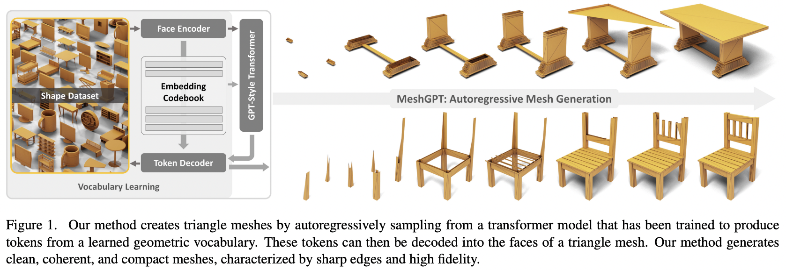

</img>

## MeshGPT - Pytorch

Implementation of <a href="https://arxiv.org/abs/2311.15475">MeshGPT</a>, SOTA Mesh generation using Attention, in Pytorch

Will also add text conditioning, for eventual text-to-3d asset

## Appreciation

- <a href="https://stability.ai/">StabilityAI</a>, <a href="https://a16z.com/supporting-the-open-source-ai-community/">A16Z Open Source AI Grant Program</a>, and <a href="https://huggingface.co/">🤗 Huggingface</a> for the generous sponsorships, as well as my other sponsors, for affording me the independence to open source current artificial intelligence research

- <a href="https://github.com/arogozhnikov/einops">Einops</a> for making my life easy

- <a href="https://github.com/MarcusLoppe">Marcus</a> for the initial code review (pointing out some missing derived features) as well as running the first successful end-to-end experiments

## Install

```bash
$ pip install meshgpt-pytorch
```

## Usage

```python
import torch

from meshgpt_pytorch import (
    MeshAutoencoder,
    MeshTransformer
)

# autoencoder

autoencoder = MeshAutoencoder(
    dim = 512,
    encoder_depth = 6,
    decoder_depth = 6,
    num_discrete_coors = 128
)

# mock inputs

vertices = torch.randn((2, 121, 3))            # (batch, num vertices, coor (3))
faces = torch.randint(0, 121, (2, 64, 3))      # (batch, num faces, vertices (3))

# make sure faces are padded with `-1` for variable lengthed meshes

# forward in the faces

loss = autoencoder(
    vertices = vertices,
    faces = faces
)

loss.backward()

# after much training...
# you can pass in the raw face data above to train a transformer to model this sequence of face vertices

transformer = MeshTransformer(
    autoencoder,
    dim = 512,
    max_seq_len = 768
)

loss = transformer(
    vertices = vertices,
    faces = faces
)

loss.backward()

# after much training of transformer, you can now sample novel 3d assets

faces_coordinates = transformer.generate()

# (batch, num faces, vertices (3), coordinates (3))
# now post process for the generated 3d asset

```

For <a href="https://www.youtube.com/watch?v=NXX0dKw4SjI">text-conditioned 3d shape synthesis</a>, simply set `condition_on_text = True` on your `MeshTransformer`, and then pass in your list of descriptions as the `texts` keyword argument

ex.
```python
transformer = MeshTransformer(
    autoencoder,
    dim = 512,
    max_seq_len = 768,
    condition_on_text = True
).cpu()


loss = transformer(
    vertices = vertices,
    faces = faces,
    texts = ['a high chair', 'a small teapot'],
)

loss.backward()

# after much training of transformer, you can now sample novel 3d assets conditioned on text

faces_coordinates = transformer.generate(texts = ['a long table'])

```

## Todo

- [x] autoencoder
    - [x] encoder sageconv with torch geometric
    - [x] proper scatter mean accounting for padding for meaning the vertices and RVQ the vertices before gathering back for decoder
    - [x] complete decoder and reconstruction loss + commitment loss
    - [x] handle variable lengthed faces
    - [x] add option to use residual LFQ, latest quantization development that scales code utilization
    - [x] xcit linear attention in encoder and decoder
    - [x] figure out how to auto-derive `face_edges` directly from faces and vertices
    - [x] embed any derived values (area, angles, etc) from the vertices before sage convs

- [ ] transformer
    - [x] properly mask out eos logit during generation
    - [x] make sure it trains
        - [x] take care of sos token automatically
        - [x] take care of eos token automatically if sequence length or mask is passed in
    - [x] handle variable lengthed faces
        - [x] on forwards
        - [x] on generation, do all eos logic + substitute everything after eos with pad id
    - [x] generation + cache kv

- [x] trainer wrapper with hf accelerate
    - [x] autoencoder - take care of ema
    - [x] transformer

- [x] text conditioning using own CFG library
    - [x] complete preliminary text conditioning
    - [ ] make sure CFG library can support passing in arguments to the two separate calls when cond scaling (as well as aggregating their outputs)
- [x] hierarchical transformers (using the RQ transformer)
- [x] fix caching in simple gateloop layer in other repo

- [ ] fix kv caching for two-staged hierarchical transformer
- [ ] allow for customization of model dimensions of fine vs coarse attention network

- [ ] make transformer efficient
    - [ ] reversible networks
    - [ ] local attention + sparse global attention
    - [ ] give mamba a test drive

- [ ] speculative decoding option

## Citations

```bibtex
@inproceedings{Siddiqui2023MeshGPTGT,
    title   = {MeshGPT: Generating Triangle Meshes with Decoder-Only Transformers},
    author  = {Yawar Siddiqui and Antonio Alliegro and Alexey Artemov and Tatiana Tommasi and Daniele Sirigatti and Vladislav Rosov and Angela Dai and Matthias Nie{\ss}ner},
    year    = {2023},
    url     = {https://api.semanticscholar.org/CorpusID:265457242}
}
```

```bibtex
@inproceedings{dao2022flashattention,
    title   = {Flash{A}ttention: Fast and Memory-Efficient Exact Attention with {IO}-Awareness},
    author  = {Dao, Tri and Fu, Daniel Y. and Ermon, Stefano and Rudra, Atri and R{\'e}, Christopher},
    booktitle = {Advances in Neural Information Processing Systems},
    year    = {2022}
}
```

```bibtex
@inproceedings{Leviathan2022FastIF,
    title   = {Fast Inference from Transformers via Speculative Decoding},
    author  = {Yaniv Leviathan and Matan Kalman and Y. Matias},
    booktitle = {International Conference on Machine Learning},
    year    = {2022},
    url     = {https://api.semanticscholar.org/CorpusID:254096365}
}
```

```bibtex
@misc{yu2023language,
    title   = {Language Model Beats Diffusion -- Tokenizer is Key to Visual Generation}, 
    author  = {Lijun Yu and José Lezama and Nitesh B. Gundavarapu and Luca Versari and Kihyuk Sohn and David Minnen and Yong Cheng and Agrim Gupta and Xiuye Gu and Alexander G. Hauptmann and Boqing Gong and Ming-Hsuan Yang and Irfan Essa and David A. Ross and Lu Jiang},
    year    = {2023},
    eprint  = {2310.05737},
    archivePrefix = {arXiv},
    primaryClass = {cs.CV}
}
```

```bibtex
@article{Lee2022AutoregressiveIG,
    title   = {Autoregressive Image Generation using Residual Quantization},
    author  = {Doyup Lee and Chiheon Kim and Saehoon Kim and Minsu Cho and Wook-Shin Han},
    journal = {2022 IEEE/CVF Conference on Computer Vision and Pattern Recognition (CVPR)},
    year    = {2022},
    pages   = {11513-11522},
    url     = {https://api.semanticscholar.org/CorpusID:247244535}
}
```

```bibtex
@inproceedings{Katsch2023GateLoopFD,
    title   = {GateLoop: Fully Data-Controlled Linear Recurrence for Sequence Modeling},
    author  = {Tobias Katsch},
    year    = {2023},
    url     = {https://api.semanticscholar.org/CorpusID:265018962}
}
```
